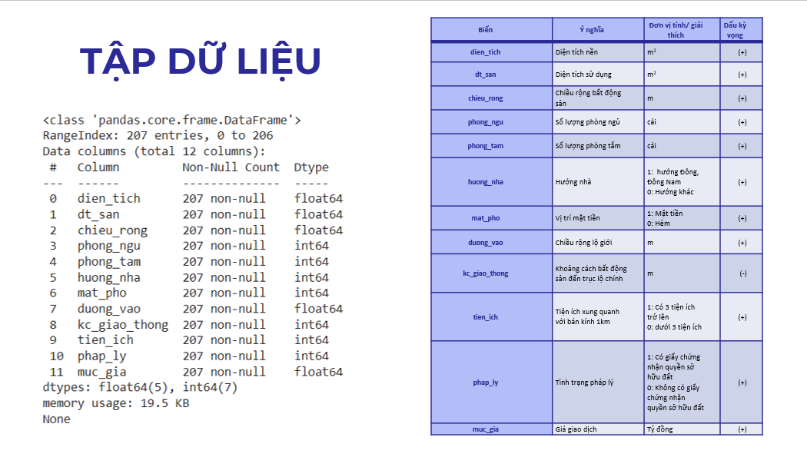
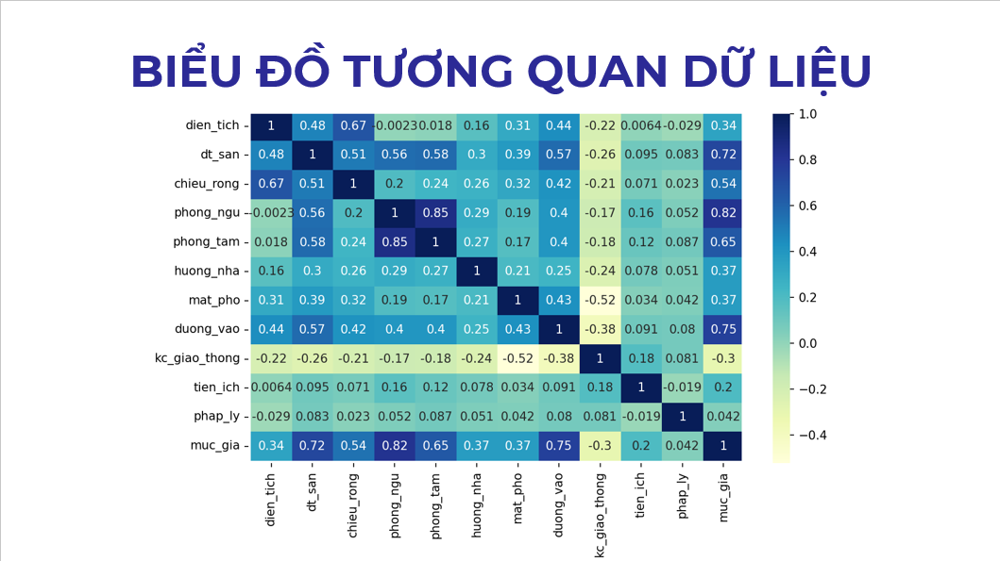
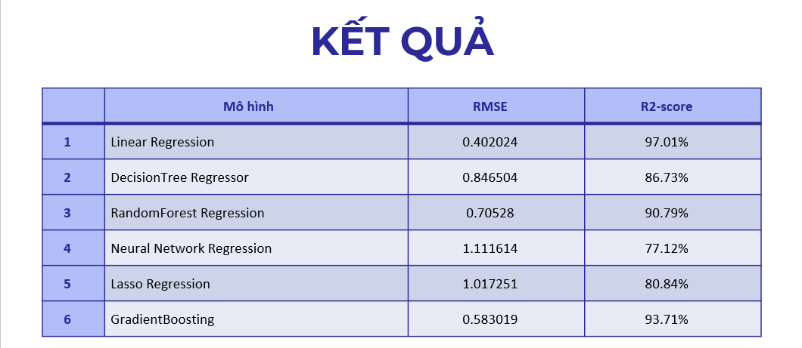

# Building an application to predict real estate prices in Ninh Kiều - Cần Thơ


The dataset comprises 207 property records, with the price variable being the target, while the remaining 
columns contain property-related information such as usable area, width, number of bedrooms, number of bathrooms, and road frontage.

The primary objective is to train a regression machine learning model to generate more accurate cost estimates. 
As a regression problem, metrics such as the coefficient of determination (R-squared) and mean squared error will be used to evaluate the model's performance.
The predictions generated by this application assist users in assessing the potential value of properties they are 
interested in and making informed decisions regarding real estate investments in Ninh Kiều - Cần Thơ.

## Dataset visualization



## Building regression models
### Regression Algorithms
- Criteria for Evaluating Regression Models: In practice, there are many criteria to evaluate regression models. For example:
  - MSE (Mean Squared Error): Represents the average squared difference between the actual value and the predicted value, extracted by squaring the difference.
  - MAE (Mean Absolute Error): Represents the average absolute error, indicating the difference between the original value and the predicted value, extracted by taking the average absolute difference in the dataset.
  - R-squared: Represents the fit of the model to the dataset. Similar to accuracy.
  - RMSE (Root Mean Squared Error): Calculated as the square root of MSE. Considered as the standard deviation of residuals (prediction errors).
- Where:
  - 𝑦̂ is the predicted value of y.
  - 𝑦̅ is the mean value of y.
- Here I will use: **RMSE and R-squared**

### Building Regression Models:
Firstly, the entire dataset will be split into Train and Test sets in an 80:20 ratio. 
With 8 parts used for model training and 2 parts used for testing.

```py
X_train, X_test, y_train, y_test = train_test_split(X, y, test_size=0.2, random_state=42)
```

### Results
After applying 6 regression algorithms including: Linear Regression, 
RandomForest Regression, DecisionTree Regressor, GradientBoosting Regressor, Neural Network Regression, Lasso Regression.



**Based on the metrics above:**
- Linear Regression performs the best with low MSE, low MAE, R2_score close to 97.01%, and the lowest RMSE (0.4020),
indicating that this model fits the data well and makes good predictions.
- Random Forest Regression and Gradient Boosting Regression also perform well, with relatively low MSE, MAE, R2_score, and RMSE.
- Decision Tree Regression and Neural Network Regression have poorer performance compared to other models, with higher MSE, MAE, R2_score, and RMSE.
- Lasso Model Regression has the worst performance among all models, with the highest MSE, MAE, R2_score, and RMSE.

**Based on all metrics, Linear Regression is the best model in this case.**

Regression equation:

  _**muc_gia = -0.9789 + 0.0027*dt_san + 0.371*chieu_rong + 1.4762*phong_ngu - 0.5772*phong_tam + 0.1304*duong_vao**_


